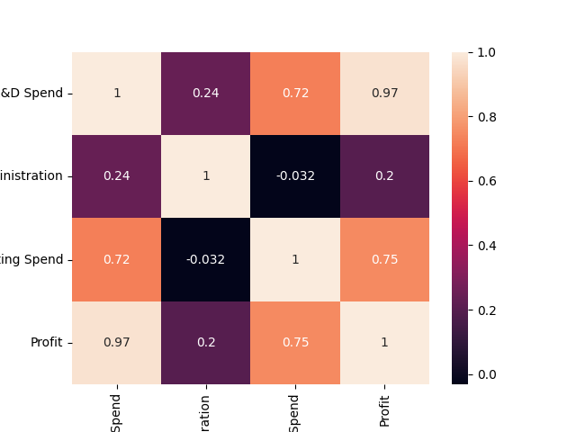
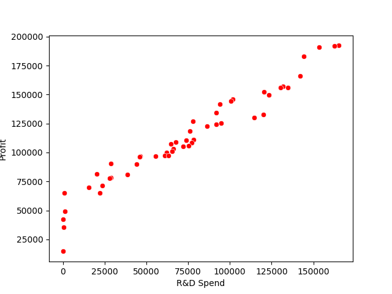
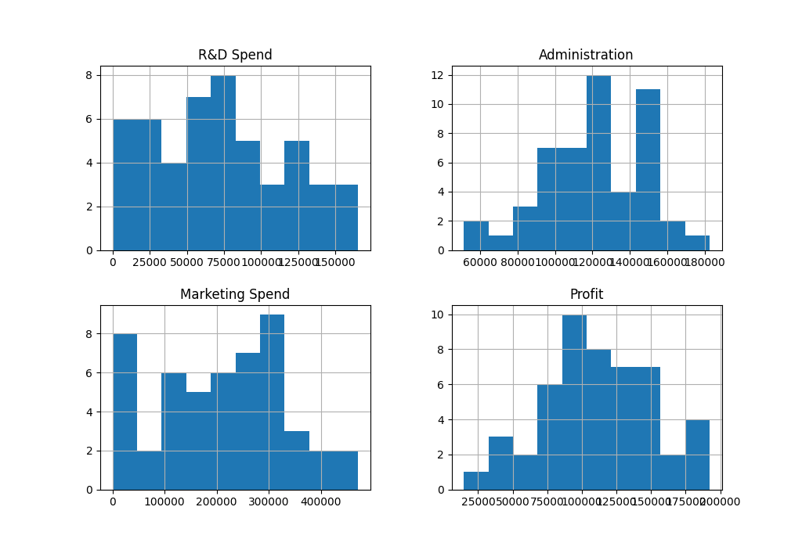
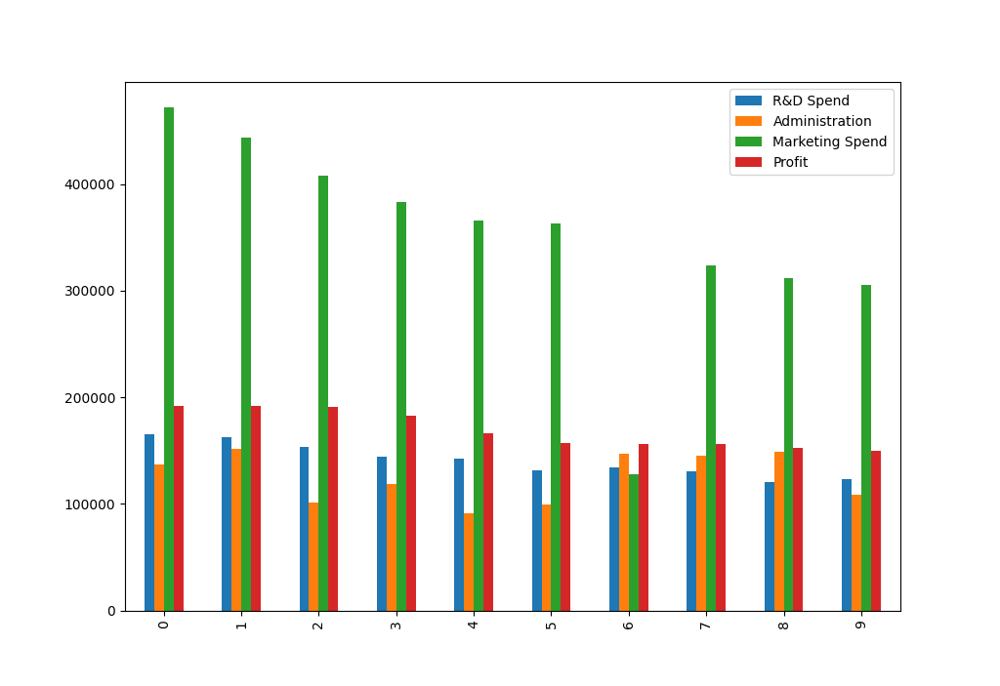

# Predicting Startup Profit with Linear Regression

This repository contains Python code to build a predictive model using linear regression to estimate the profit of startup companies based on various features.

## Purpose

The purpose of this project is to develop a machine learning model that can accurately predict the profit of startup companies. By analyzing factors such as R&D spending, administration costs, marketing spend, and the state in which the company operates, the model aims to provide insights into the key drivers of profitability in the startup ecosystem.

## Dataset Description

The dataset used in this project, "StartUp.csv", contains information about 50 startup companies. Each row represents a startup, and the columns include the following features:

- R&D Spend: Amount spent on research and development
- Administration: Administration expenses
- Marketing Spend: Amount spent on marketing
- State: State in which the company operates
- Profit: Profit generated by the startup

## Insights from Data Analysis

Exploratory data analysis (EDA) reveals several insights into the relationship between startup features and profitability:

- There is a strong positive correlation between R&D spending and profit, indicating that investing in research and development can lead to higher profits.
- Marketing spend also shows a positive correlation with profit, suggesting that effective marketing strategies contribute to profitability.
- Administration expenses do not show a significant correlation with profit, implying that minimizing administration costs may not have a direct impact on profitability.

## Potential Applications

The predictive model developed in this project can have several practical applications, including:

- Assisting investors in identifying promising startup opportunities by predicting potential profitability based on key features.
- Providing startup founders and managers with insights into the factors that drive profitability, enabling them to optimize resource allocation and strategic decision-making.
- Supporting policymakers and economic analysts in understanding the dynamics of the startup ecosystem and formulating policies to foster innovation and entrepreneurship.

## Dependencies

- Python 3.x
- pandas
- numpy
- seaborn
- matplotlib
- statsmodels
- scikit-learn

## Output

The output includes several plots and performance metrics:

	- The heatmap of the corelation coffecint
 

	- The Relation between the R&D Spend and the Profit

	- R&D, Administration, Marketing, Profit Histogram
 

	- Bar Char
 